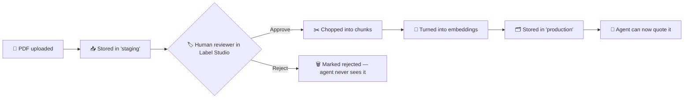

# 1. Overview

> **What is Psyche-Agent, who is it for, and why does it exist?**

[← Back to index](./README.md)

---

## 🎯 What it is

**Psyche-Agent** (also called **Ravanyar / روان‌یار**) is a chatbot that answers psychology questions in **Persian** (and English, if you prefer).

Think of it as a **librarian**, not a doctor:

- 📚 A librarian only tells you what's in the books on the shelf. They won't make up a chapter that doesn't exist.
- 🩺 A doctor diagnoses and prescribes. The librarian does not.

Psyche-Agent is the librarian. It reads books that a real psychology professional has vetted, then quotes them back to you in your language.

---

## 🧐 Why it exists

There's a lot of bad psychology advice on the internet — "manifest your dreams!", "energy healing cures depression!", etc. In Persian-speaking communities specifically, evidence-based mental-health information is often hard to find or paywalled in English.

Psyche-Agent solves two problems at once:

1. **Quality** — Every source is approved by a human before the bot can see it.
2. **Language** — Answers are delivered in Persian (or English), even when the source is in another language.

---

## 🚦 What it will and won't do

### ✅ It WILL:
- Explain concepts ("What are the symptoms of generalized anxiety disorder?")
- Cite the source ("according to *Anxiety Disorders Overview*…")
- Translate between Persian and English
- Greet you casually if you say "hi" or "سلام"
- Admit "I don't know" when sources don't cover the topic
- Remember conversations (chat history)
- Suggest you contact emergency services if your message hints at a crisis

### 🚫 It WON'T:
- Diagnose you
- Recommend medication or dosage
- Suggest a treatment plan
- Make up facts to fill gaps
- Quote a source that wasn't human-approved
- Send your data anywhere on the internet (everything runs locally)

---

## 👥 Who it's for

| Role | What they do with it |
|------|----------------------|
| **End user** (curious person) | Asks psychology questions, gets sourced answers in Persian |
| **Content reviewer** (psychologist or trained reader) | Uploads PDFs and approves/rejects them in Label Studio |
| **Operator** (whoever runs the server) | Deploys docker-compose, monitors metrics, manages backups |
| **Developer** | Extends the agent, adds new sources, tunes prompts |

---

## 🏛️ The Big Rule: Human-in-the-Loop

The single most important design decision is this:

> **No document reaches the agent without a human approving it.**

Here's the lifecycle of a PDF:

Even if a malicious actor uploaded a fake source full of dangerous advice, the agent would never use it unless a human clicked "approve". This is why we trust the answers.

---

## 🔒 Privacy & Data Flow

Because **everything is local**:

- 🏠 PDFs you upload never leave your server.
- 💬 Chat conversations never leave your server.
- 🌐 The translation service (LibreTranslate) is a docker container, not Google Translate.
- 🧠 The LLM (Ollama) runs on your CPU/GPU, not OpenAI.

The only outbound traffic is when you **first start** Ollama and it downloads the LLM model. After that, everything is offline-capable.

> 💡 **For clinics and researchers:** this matters because patient queries and source documents stay on-prem. No third-party processor is involved.

---

## 📌 Status

- **Version:** `0.1.0-alpha`
- **Maturity:** Early. Works end-to-end but expect rough edges.
- **What's stable:** Ingest → review → ask → answer loop. Chat sessions. Multilingual responses.
- **What's experimental:** Verbosity tuning, small-talk detection thresholds, internet-source plugin (stub only).

See [Roadmap](./10-roadmap.md) for what's planned.

---

[← Back to index](./README.md) · [Next: Architecture →](./02-architecture.md)
