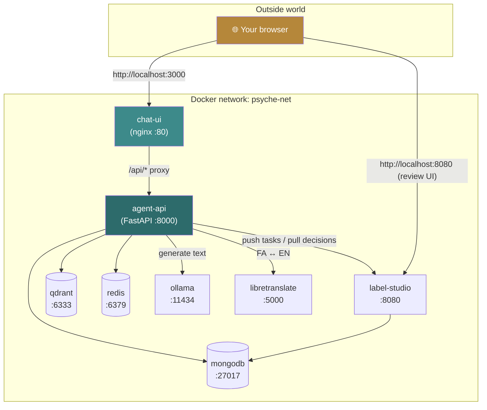
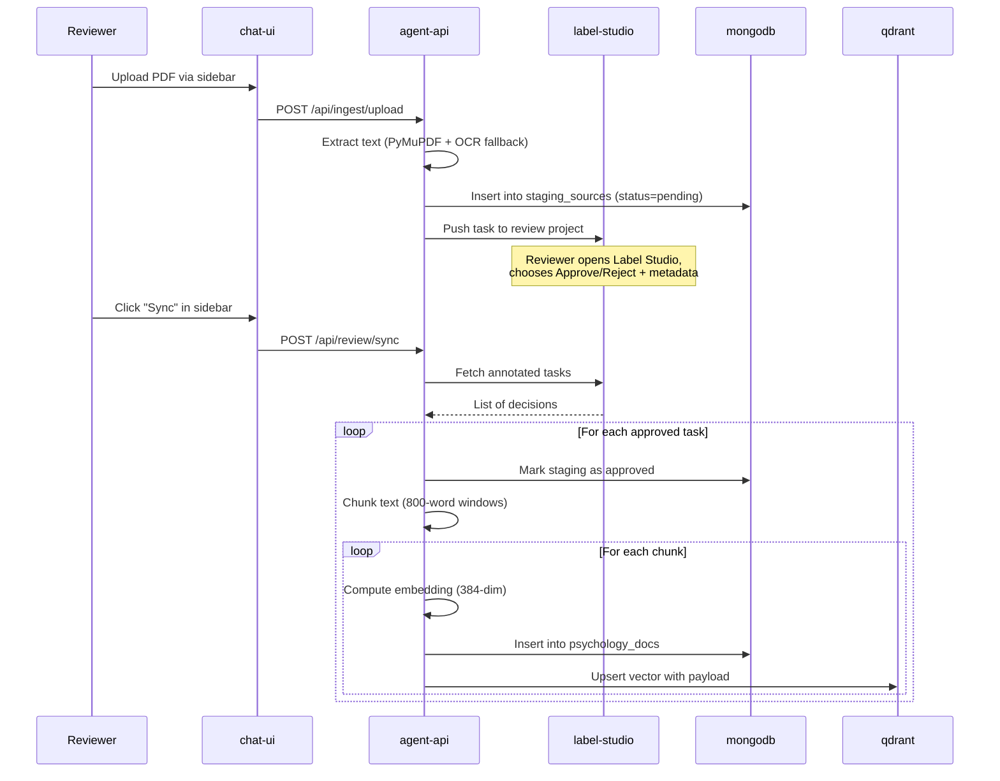
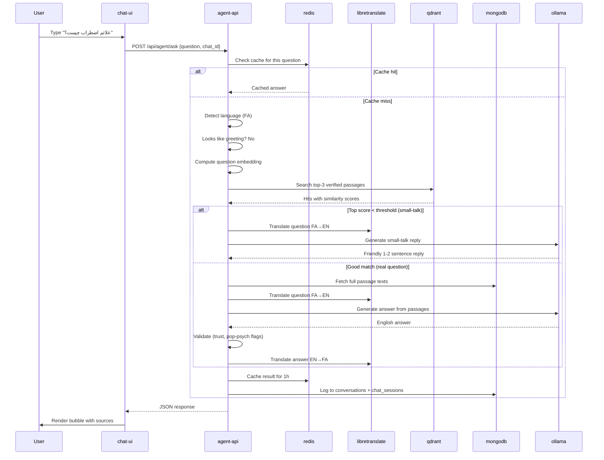

# 2. Architecture

> **The big picture: every box, every arrow, every container.**

[← Index](./README.md) · [← Overview](./01-overview.md) · [Next: Getting Started →](./03-getting-started.md)

---

## 🗺️ The 30-second mental model

Think of Psyche-Agent as a small **office** with several specialized rooms:

| Room | What happens there | Container |
|------|--------------------|-----------|
| 🚪 **Reception** | Visitors arrive (HTTP requests), get routed to the right room | `chat-ui` (nginx) |
| 🧑‍💼 **Manager's office** | Decides which question goes where, handles chats | `agent-api` (FastAPI) |
| 🗄️ **Filing cabinet** | Stores every document, chat, decision | `mongodb` |
| 🔍 **Index card box** | Finds passages by meaning, not just words | `qdrant` |
| 📌 **Sticky-note board** | Cached answers to recent questions | `redis` |
| 🧠 **The thinker** | Local LLM that writes the actual answer text | `ollama` |
| 🌍 **Translator** | Translates Persian ↔ English | `libretranslate` |
| 🏷️ **Review desk** | Where humans approve/reject sources | `label-studio` |

All 8 rooms (containers) talk to each other over a private docker network. Only the **reception** (`chat-ui`) is reachable from outside — that's how your browser connects.

---

## 📐 Full architecture diagram



---

## 🚪 Port map

| Service | Inside docker network | Outside (host) port | Used for |
|---------|----------------------|---------------------|----------|
| chat-ui | `:80` | `:3000` | Web app you open in browser |
| agent-api | `:8000` | `:8000` | Direct API (also `/docs` for Swagger) |
| label-studio | `:8080` | `:8080` | Reviewer UI |
| qdrant | `:6333` | `:6333` | Vector dashboard at `/dashboard` |
| libretranslate | `:5000` | `:5000` | Translation API |
| ollama | `:11434` | `:11434` | LLM (rarely accessed directly) |
| mongodb | `:27017` | — | Not exposed to host |
| redis | `:6379` | — | Not exposed to host |

> 💡 **Why are some not exposed?** Mongo and Redis hold sensitive data (chat history, cached answers). Keeping them docker-internal-only is a small but free security win.

---

## 🔁 Two main flows

### Flow A: A reviewer adds a new source



### Flow B: A user asks a question



---

## 🧱 MongoDB collections

```
psyche (database)
├── staging_sources       — uploaded files awaiting / after review
├── psychology_docs       — approved, chunked, embedded passages (the only thing the agent sees)
├── conversations         — append-only audit log of every Q&A
└── chat_sessions         — grouped multi-turn conversations with title + messages
```

> 🔒 **Visibility rule:** The agent **only reads `psychology_docs`**. Everything else is for auditing or workflow. If a document isn't in `psychology_docs`, the agent literally cannot quote it.

See [Code Walkthrough → main.py](./07-code-walkthrough.md#mainpy) for the exact queries.

---

## 🌍 Where data lives on disk

Docker volumes persist across container restarts. They live under `~/Library/Containers/com.docker.docker/...` on macOS or `/var/lib/docker/volumes/` on Linux.

| Volume | What's in it |
|--------|--------------|
| `mongo_data` | All MongoDB collections |
| `qdrant_data` | Vector index files |
| `ollama_data` | Downloaded LLM models (can be several GB) |
| `label_studio_data` | Annotation project state |

> ⚠️ **Backup tip:** if you only back up one thing, back up `mongo_data` — that's your source of truth. Qdrant can be rebuilt by re-embedding `psychology_docs`.

---

## 🤝 How services authenticate to each other

| From | To | Auth method |
|------|----|----|
| agent-api | mongodb | Username/password from `.env` |
| agent-api | qdrant | None (network isolation) |
| agent-api | redis | None (network isolation) |
| agent-api | ollama | None (network isolation) |
| agent-api | libretranslate | None (network isolation) |
| agent-api | label-studio | API token (`LABEL_STUDIO_API_KEY` in `.env`) |
| browser | chat-ui | None (alpha — do not expose to internet) |

> 🛑 **Security note:** This project is intended for **single-tenant local use**. The alpha API has no user authentication. Do not expose `:8000` or `:3000` to the public internet without adding auth.

---

## 🎛️ Why these specific technologies?

| Choice | Alternative | Why we picked it |
|--------|-------------|------------------|
| **Ollama** | OpenAI API, Anthropic API | Free, runs offline, no per-token billing |
| **Qdrant** | Pinecone, Weaviate, pgvector | Open source, very fast, great Docker image |
| **MongoDB** | Postgres | Flexible schema for evolving document shapes |
| **Redis** | In-memory dict | Persistent across restarts, atomic TTL |
| **LibreTranslate** | Google Translate, DeepL | Self-hosted = no API key, no data leakage |
| **Label Studio** | Custom UI | Already perfect for our annotation flow |
| **FastAPI** | Flask, Django | Async, type hints, auto Swagger `/docs` |
| **paraphrase-multilingual-MiniLM** | OpenAI embeddings | Multilingual, 384-dim, runs on CPU |

---

[← Index](./README.md) · [Next: Getting Started →](./03-getting-started.md)
