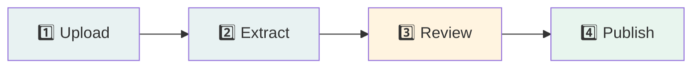
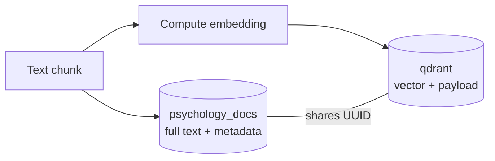
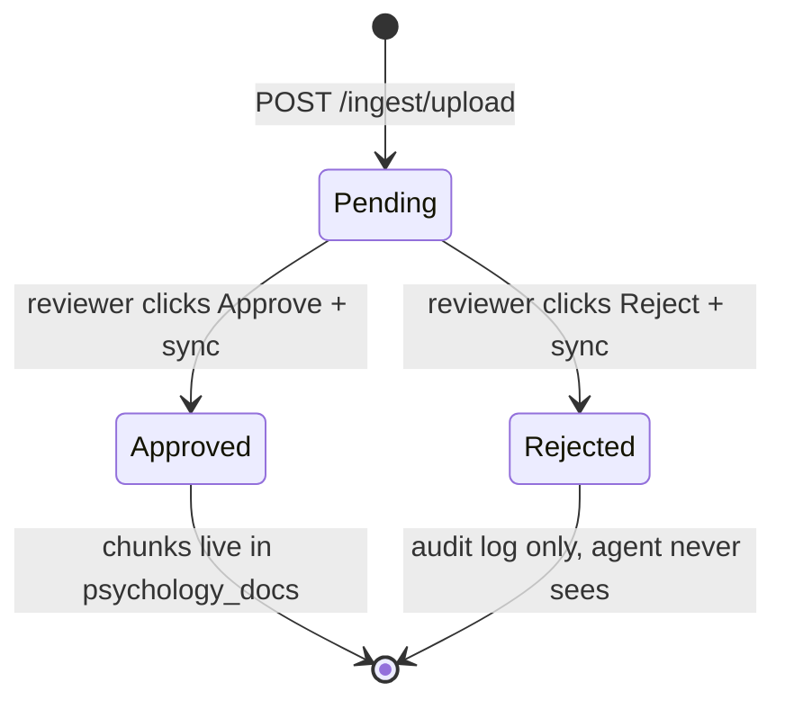

# 4. Knowledge Pipeline

> **The journey of a PDF: from your upload to a quotable passage.**

[← Index](./README.md) · [← Getting Started](./03-getting-started.md) · [Next: Agent & Chat →](./05-agent-and-chat.md)

---

## 🛤️ The four stages

Every source goes through these four stages, in order. **No stage can be skipped.**



| Stage | What happens | Container that does it | Output |
|-------|--------------|------------------------|--------|
| 1️⃣ Upload | You hand over a PDF/EPUB | `agent-api` | File bytes in memory |
| 2️⃣ Extract | Pull the text out | `agent-api` | Plain text + language detected |
| 3️⃣ Review | A human looks at it | `label-studio` | Approve/Reject + metadata |
| 4️⃣ Publish | Chunk, embed, store | `agent-api` | Searchable vectors in Qdrant |

---

## 1️⃣ Upload

### What you do
Either:
- Drag a file onto the sidebar upload zone in the chat UI, OR
- Call the API: `POST /ingest/upload` with `multipart/form-data`

```bash
curl -X POST http://localhost:8000/ingest/upload \
     -F "file=@dsm5.pdf"
```

### What the server does

Step-by-step inside `app/main.py::ingest_upload`:

1. **Validate the filename** — must end in `.pdf` or `.epub`, else 400.
2. **Read the bytes** asynchronously into memory.
3. **Call `extract_text` or `extract_epub`** from `services.py` to get plain text.
4. If text is empty → 422 error ("nothing extractable").
5. **Detect language** by counting Persian Unicode characters.
6. **Insert into MongoDB `staging_sources`** with `status: "pending"`.
7. **Push a task to Label Studio** so the reviewer sees it in their queue.
8. Return `{ staging_id, language, extraction_method, status: "pending_review" }`.

### Where it lands

| Storage | Field | Value |
|---------|-------|-------|
| `mongo.staging_sources` | `status` | `"pending"` |
| `mongo.staging_sources` | `extracted_text` | The full text |
| `mongo.staging_sources` | `language` | `"fa"` or `"en"` |
| `mongo.staging_sources` | `label_studio_task` | Response from LS API |
| `label-studio` | Task in your review project | Same text shown for annotation |

> 🛑 **At this point the agent CANNOT see this document.** It's in staging only.

---

## 2️⃣ Extract

### Text-layer PDFs (fast path)
Most modern PDFs have an embedded text layer. PyMuPDF (`fitz`) extracts it in milliseconds:

```python
doc = fitz.open(stream=pdf_bytes, filetype="pdf")
text = "\n".join(page.get_text() for page in doc)
```

→ `extraction_method: "text-layer"`

### Scanned PDFs (OCR fallback)
If the extracted text is suspiciously short (<100 chars), we assume it's a scan and fall back to Tesseract OCR with Persian + English language packs:

```python
pages = convert_from_bytes(pdf_bytes, dpi=300)
text = "\n".join(pytesseract.image_to_string(p, lang="fas+eng") for p in pages)
```

→ `extraction_method: "ocr"`

> 💡 **Tip:** OCR is slow (~5–30 seconds per page on CPU). Quality depends on scan resolution — aim for 300 DPI source scans.

### EPUB
EPUBs are ZIP archives of XHTML chapters. We open the archive, strip HTML tags with BeautifulSoup, join the text, and skip nav/toc files:

```python
zf = zipfile.ZipFile(io.BytesIO(epub_bytes))
# ...filter to .html/.xhtml entries, skip nav/toc/cover...
soup = BeautifulSoup(html, "lxml")
soup.get_text(separator="\n", strip=True)
```

→ `extraction_method: "epub"`

### Language detection
Lightweight — count characters in the Persian Unicode block (`U+0600..U+06FF`):

```python
persian = sum(1 for c in text if "؀" <= c <= "ۿ")
return "fa" if persian / len(text) > 0.25 else "en"
```

Anything ≥25% Persian characters is labeled Persian. Crude but works for most documents.

---

## 3️⃣ Review

This is the **most important** stage. Without a human approval, **nothing reaches the agent**.

### What the reviewer sees in Label Studio

The XML config we set up in [Getting Started → Step 5b](./03-getting-started.md#5b-create-the-review-project) renders this form:

| Field | Type | Required | Purpose |
|-------|------|----------|---------|
| **decision** | Approve / Reject (radio) | ✅ Yes | The gate |
| **source_name** | text | If approving | Becomes the citation in answers |
| **source_type** | clinical / textbook / article / unverified | Optional | Filtering & metadata |
| **trust_score** | text (0.0–1.0) | If approving | Weights the answer confidence |
| **notes** | text | Optional | For rejected items: why? |

### What "approve" really means

When the reviewer clicks **Submit** with `decision=Approve`, Label Studio stores the annotation. Nothing else happens automatically — the agent doesn't yet know.

To pull decisions into the agent, you trigger a **sync**:

- UI: click **🔁 Sync Now** in the sidebar
- API: `POST /review/sync`

### What sync does (in `review_sync`)

```python
tasks = label_studio.fetch_tasks()
for task in tasks:
    fields = _parse_annotation(task)         # flatten LS JSON
    staging_doc = ... locate by staging_id ...
    if fields["decision"] == "Approve":
        chunk_ids = _promote_to_production(staging_doc, metadata)
        # mark staging as approved
    else:
        # mark staging as rejected (audit only)
```

Edge case handled: if a reviewer uploaded a PDF **directly inside Label Studio** (bypassing `/ingest/upload`), the helper `_staging_from_ls_task` fetches the file back from LS's media server, extracts it, and creates the staging record on the fly. The user never has to know — it just works.

---

## 4️⃣ Publish

This is the only stage that makes a document **visible to the agent**.

### Chunking
Approved text is split into **800-word windows with 120-word overlap**. The overlap means a sentence near a boundary appears in both chunks — preventing the embedder from losing context.

```python
def chunk_text(text, size=800, overlap=120):
    words = text.split()
    chunks, i = [], 0
    while i < len(words):
        chunks.append(" ".join(words[i : i + size]))
        i += size - overlap
    return chunks
```

> 💡 **Why 800?** Empirically, ~800 words ≈ 1000–1100 tokens, which fits comfortably inside the LLM's prompt window when combined with the question and system prompt.

### Embedding
Each chunk is turned into a **384-dimensional vector** by the multilingual MiniLM model:

```python
SentenceTransformer("paraphrase-multilingual-MiniLM-L12-v2").encode(
    chunk, normalize_embeddings=True
)
```

> 🌍 **Multilingual magic:** This model puts Persian and English text into the **same vector space**. A Persian question about "اضطراب" will find an English passage about "anxiety" — without translation. That's why we can have an English-heavy corpus and still answer Persian questions accurately.

### Storage
For every chunk, two records are written **atomically** (well, near-atomically):



| Store | What it holds | Why |
|-------|---------------|-----|
| `mongo.psychology_docs` | Full chunk text + source name + trust score | Source of truth for the actual content |
| `qdrant.psychology_docs` (collection) | 384-dim vector + minimal payload (`mongo_id`, `source_name`, `trust_score`, `is_verified`) | Fast similarity search |

The Mongo `_id` and Qdrant point `id` (a UUID) are stored on **both** records so we can jump from a search hit back to the full text.

### What gets marked

After publishing, the staging doc gets updated:

```python
db.staging_sources.update_one(
    {"_id": staging_doc["_id"]},
    {"$set": {
        "status": "approved",
        "reviewed_at": now,
        "approved_metadata": {...},
        "production_chunk_ids": [list of mongo IDs created],
    }}
)
```

This breadcrumb lets us **un-publish** later (delete those chunk IDs) without re-running OCR.

---

## 🔁 Lifecycle summary



---

## 🧐 Frequently asked questions

### Can I re-upload the same file?
Yes, but it creates a new staging record. If the reviewer approves both, you get duplicate chunks. There's no automatic dedup yet — see [Roadmap](./10-roadmap.md).

### Can I edit a chunk after it's published?
Not via UI. You'd manually update `psychology_docs` in Mongo and re-embed in Qdrant. Easier path: delete + re-upload.

### What's `is_verified` doing in Qdrant payload?
Every query is filtered by `is_verified=true`. The field is **always** `true` for chunks in production — the redundancy is intentional defense-in-depth: even if a bug somehow inserted an unverified chunk, the query filter would skip it.

### What if a source is in a third language (e.g., Arabic)?
The multilingual MiniLM model supports many languages, so retrieval will work. But the agent always responds in Persian or English (whatever the user picked) via LibreTranslate, which is FA↔EN only. So Arabic in → English/Persian out works; Arabic out is not supported.

### Why isn't this real-time? Why a manual sync?
Label Studio doesn't push webhooks out of the box. Polling on a manual button gives reviewers a clear "I'm done" moment and avoids hammering LS's API. A scheduled sync (cron / k8s job) is fine for production — see [Roadmap](./10-roadmap.md).

---

[← Index](./README.md) · [Next: Agent & Chat →](./05-agent-and-chat.md)
