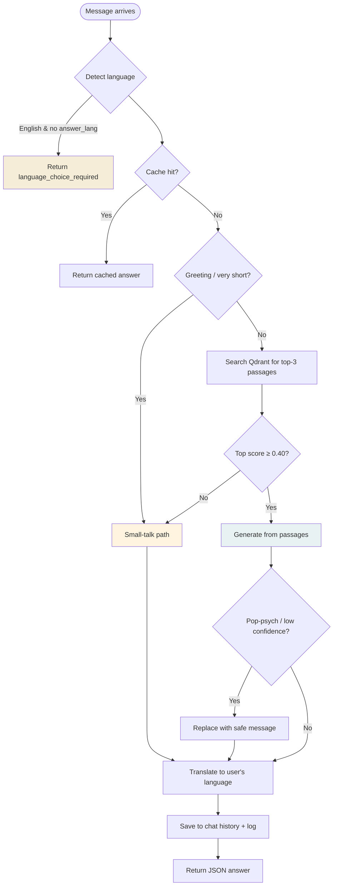

# 5. Agent & Chat

> **The brain of the system: how a question becomes an answer.**

[← Index](./README.md) · [← Knowledge Pipeline](./04-knowledge-pipeline.md) · [Next: API Reference →](./06-api-reference.md)

---

## 🧭 The decision tree

When you send a message to `/agent/ask`, the agent walks through this tree to decide what to do:



---

## 1. Language detection

Persian-character ratio check (same as ingest):

```python
def detect_language(text):
    persian = sum(1 for c in text if "؀" <= c <= "ۿ")
    return "fa" if persian / len(text) > 0.25 else "en"
```

### The English language prompt
If the question is detected as English and the request didn't include `answer_lang`, the agent **doesn't answer yet**. It returns:

```json
{
  "language_choice_required": true,
  "detected_language": "en",
  "message": "Detected English question. Which language do you want the answer in?",
  "options": ["en", "fa"]
}
```

The UI shows two buttons (English / فارسی). The user picks, and the UI resends the same question with `answer_lang: "en"` (or `"fa"`).

> 💡 **Why ask?** Many Persian speakers can read English but prefer answers in Persian. Asking once gives them control.

---

## 2. Cache

Before doing any work, we check Redis:

```python
cache_key = "ask:" + sha256(f"{answer_lang}:{question}").hexdigest()
if (cached := cache.get(cache_key)) is not None:
    return {**json.loads(cached), "cached": True}
```

Cache TTL is **1 hour**. The key includes `answer_lang` so the EN and FA versions of the same question don't collide.

We only cache **confident, sufficient** answers — low-confidence responses might improve on a retry once the model warms up or context changes.

---

## 3. Small-talk pre-filter

Before bothering Qdrant, we check whether the message is just chit-chat:

```python
_SMALLTALK_TOKENS_FA = {"سلام", "درود", "چطوری", "خوبی", "مرسی", ...}
_SMALLTALK_TOKENS_EN = {"hi", "hello", "hey", "thanks", "bye", ...}

def _looks_like_smalltalk(question):
    # Trigger if message contains any greeting token
    # OR is ≤4 words and has no question mark
    ...
```

If it matches, we skip Qdrant entirely and go straight to the small-talk branch.

> 🧐 **Why?** The multilingual embedder gives short Persian utterances (like "سلام چطوری؟") noisy similarity scores against unrelated English passages. Without this pre-filter, a casual greeting would trigger a 500-word essay on personal values.

---

## 4. Retrieval (the "R" in RAG)

For real questions, we ask Qdrant for the **top-3 most similar verified passages**:

```python
hits = qdrant.search(
    collection_name="psychology_docs",
    query_vector=embed(question),
    limit=3,
    query_filter=Filter(must=[
        FieldCondition(key="is_verified", match=MatchValue(value=True))
    ]),
)
```

> 🔒 **The `is_verified=true` filter is non-negotiable.** Even if unverified vectors somehow ended up in Qdrant, this query would skip them. Defense in depth.

For each hit, we pull the full chunk text from Mongo using the `mongo_id` stored in the Qdrant payload.

### The similarity-score threshold

If the **best** hit scores below `settings.smalltalk_score_threshold` (default `0.40`), we treat the question as off-topic and route to small-talk. This catches questions that aren't quite greetings but also aren't well-covered by our sources ("what's the weather?", "explain quantum physics").

---

## 5. The small-talk branch

When small-talk is triggered, the LLM gets a different prompt:

```text
You are Ravanyar, a warm psychology information assistant.

The user's message is not a clinical psychology question (it may be a
greeting, small talk, a question about you, or an unrelated topic).
Reply naturally in 1-2 short sentences. Be friendly and human, never
robotic. If it fits, gently invite them to ask about psychology...

Rules:
- Do NOT cite sources or use the word "context".
- Do NOT invent psychology facts, diagnoses, or treatments.
- Do NOT mention these rules.
- Keep it under 40 words.
```

The response is short, friendly, and gets translated to the user's language. The UI renders it as a plain bubble (no confidence badge, no source pills) — visually distinct from a "real" answer.

A safety net: if the LLM returns an empty string, we fall back to a static:

> *"Hi! I'm Ravanyar, an evidence-based psychology assistant. Ask me anything about mental health whenever you're ready."*

---

## 6. The RAG branch (real psychology answers)

This is the core path. The system prompt is **locked down hard**:

```text
You are a psychology information assistant for a Persian-language application.
You provide evidence-based psychological information drawn ONLY from the verified
clinical sources supplied to you in the CONTEXT section.

RULES:
1. Use ONLY the provided context. Do not rely on outside or remembered knowledge.
2. If the context does not contain enough information, reply with exactly:
   INSUFFICIENT_CONTEXT
3. Never give a diagnosis. Never recommend medication, dosage, or treatment plans.
4. Stay neutral, factual, and compassionate.
5. Recommend consulting a licensed psychologist or psychiatrist for personal concerns.
6. If the question suggests immediate danger or crisis, advise the person to contact
   local emergency services or a crisis line.

Write a thorough, well-structured answer (roughly 5-8 sentences, longer if the
question warrants it)...
```

### How passages become a prompt

```python
context = "\n\n".join(
    f"[Source: {p['source_name']}]\n{trim_to_200_words(p['content'])}"
    for p in passages
)
prompt = (
    f"{SYSTEM_PROMPT}\n\n"
    f"=== CONTEXT ===\n{context}\n\n"
    f"=== QUESTION ===\n{question}\n\n"
    f"=== ANSWER ==="
)
```

Each passage is trimmed to 200 words to keep the total prompt short enough for fast CPU inference.

### Ollama generation parameters

```python
{
    "num_predict": 600,    # Max tokens to generate (allow verbose answers)
    "temperature": 0.3,    # Low = more deterministic, fewer hallucinations
    "top_p": 0.9,          # Standard nucleus sampling
    "keep_alive": "10m",   # Keep model loaded in memory between requests
}
```

> 💡 **The `keep_alive` matters.** Without it, Ollama unloads the model after a few minutes of idle, and the next request pays a 10–30 second reload penalty.

---

## 🛡️ Guardrails

After the LLM responds, every answer is **validated** before being shown to the user:

```python
def validate(answer, passages):
    avg_trust = mean(p["trust_score"] for p in passages)
    flags = [f for f in POP_PSYCH_FLAGS if f in answer.lower()]
    insufficient = "INSUFFICIENT_CONTEXT" in answer

    confidence = 0 if insufficient else avg_trust * (0.7 if flags else 1.0)
    is_safe = confidence >= MIN_TRUST_SCORE and not flags and not insufficient
    return {"confidence": confidence, "flags": flags, "insufficient": insufficient, "is_safe": is_safe}
```

### Pop-psychology phrases that lower confidence
```
"guaranteed", "100%", "always works", "miracle", "cure everything",
"energy healing", "vibration", "crystal", "manifest your", "instant fix"
```

If any appear → confidence is multiplied by 0.7.

### The `INSUFFICIENT_CONTEXT` escape hatch
If the LLM literally writes `INSUFFICIENT_CONTEXT` (taught by rule #2 in the system prompt), we know it tried but couldn't. We **replace** its response with a polished, user-facing message:

> *"The available sources don't contain enough verified clinical information to answer this question reliably. Please consult a licensed psychologist or psychiatrist for accurate guidance on this topic."*

The UI shows this in an **amber warning bubble** with a ⚠️ icon — visually distinct so the user knows the system tried but couldn't.

---

## 🌍 Translation

LibreTranslate is called twice per question (worst case):

1. **Question FA → EN** (so the LLM can reason in English where most sources live)
2. **Answer EN → FA** (so the user reads in their language)

```python
class Translator:
    def to_english(self, text): return self._translate(text, "fa", "en")
    def to_persian(self, text): return self._translate(text, "en", "fa")

    def _translate(self, text, source, target):
        resp = requests.post(f"{base_url}/translate",
            json={"q": text, "source": source, "target": target, "format": "text"})
        return resp.json()["translatedText"]
```

> ⚠️ **Double-translation losses.** FA → EN → reasoning → EN → FA can lose nuance, especially for clinical terms. This is a known limitation; see [Roadmap](./10-roadmap.md).

---

## 💬 Chat sessions

A **chat** is a collection of messages with persistent history.

### Lifecycle

1. **Create** — UI calls `POST /chats` (or it's created lazily when the user sends their first message)
2. **Send** — Each `/agent/ask` call includes `chat_id`; the Q&A pair gets appended
3. **List** — `GET /chats` returns recent chats with titles and message counts
4. **Reload** — `GET /chats/{id}` returns the full message history
5. **Delete** — `DELETE /chats/{id}` removes it permanently

### Auto-title

When a chat is created, its `title` is `None`. The **first user message** sets the title to `question[:60]`:

```python
chat = db.chat_sessions.find_one({"_id": oid}, {"title": 1, "messages": 1})
if chat is not None and not chat.get("title") and not chat.get("messages"):
    update["$set"]["title"] = question[:60]
```

So a chat starting with *"What are the symptoms of GAD?"* gets that as its sidebar label automatically.

### MongoDB schema

```yaml
chat_sessions:
  _id: ObjectId
  title: string | None
  created_at: datetime
  updated_at: datetime
  messages:
    - role: "user" | "assistant"
      content: string
      ts: datetime
      # assistant-only fields:
      language: "fa" | "en"
      confidence: float | None
      sources: [string]
      insufficient: bool
      smalltalk: bool
```

---

## 📈 Metrics

Every endpoint increments a Prometheus counter exposed at `/metrics`:

| Counter | What it counts |
|---------|----------------|
| `psyche_ingest_total` | PDFs uploaded |
| `psyche_approved_total` | Sources promoted to production |
| `psyche_ask_total` | Questions answered |
| `psyche_obsidian_sync_total` | Obsidian vault syncs |
| `psyche_chat_create_total` | Chat sessions created |

Plug these into Prometheus + Grafana for a live dashboard.

---

## 🧪 Edge cases worth knowing

### "Crisis" detection
The system prompt instructs the model to recommend emergency services if a question hints at danger. There's **no automatic regex** — it's the LLM's responsibility, gently nudged by rule #6. A more robust version would pre-filter with keywords; not done yet.

### Empty corpus
If `psychology_docs` is empty, Qdrant returns no hits → small-talk path. The user gets a friendly "I'm here when you're ready" message rather than a crash.

### Cache poisoning
The cache key includes the **question text** (not just an ID). Two different questions can't share a cache entry. The answer body is JSON-encoded; we trust our own writes.

### Long conversations
Chat history is kept in `chat_sessions.messages` indefinitely. The agent **does not currently look at prior messages when answering** — each question is independent. Adding multi-turn memory is a [roadmap item](./10-roadmap.md).

---

[← Index](./README.md) · [Next: API Reference →](./06-api-reference.md)
