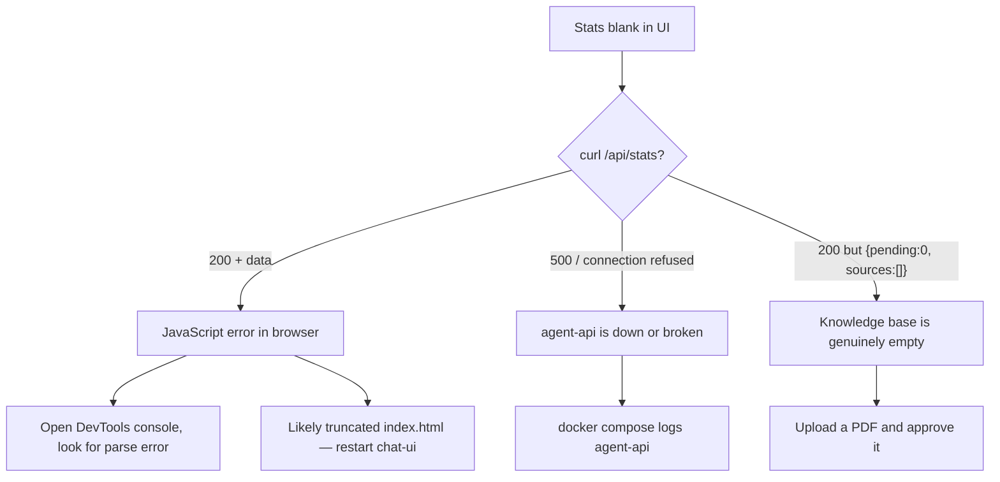

# 9. Troubleshooting

> **Problems we've actually hit, and exactly how to fix them.**

[← Index](./README.md) · [← Configuration](./08-configuration.md) · [Next: Roadmap →](./10-roadmap.md)

---

## 🛑 The Docker Restart Rule (read this first)

> **The single most common source of "Claude broke the app" frustration.**

Some files in this project are **bind-mounted** as single files into containers (`ui/index.html` into nginx, `app/` into agent-api at build time). On **macOS Docker Desktop** specifically, when an editor saves with an atomic-replace (write-temp-then-rename), the container can keep serving the **old inode** indefinitely — including a truncated/partial copy.

When this happens, the JavaScript inside `index.html` parses mid-statement and dies, killing **every** UI feature at once: theme toggle, language switch, stats loader, send button — all dead. It looks catastrophic; the fix is one command.

### Rule of thumb

| Edited | Run |
|--------|-----|
| `ui/index.html` or `ui/nginx.conf` | `docker compose restart chat-ui` |
| Any file under `app/` | `docker compose up -d --build agent-api` |
| `requirements.txt` or `Dockerfile` | `docker compose up -d --build agent-api` |
| `docker-compose.yml` | `docker compose up -d` |
| `.env` | `docker compose restart agent-api` |

### How to verify the UI restart worked

```bash
# Source file
wc -l ui/index.html
# What nginx is actually serving
curl -s http://localhost:3000/ | wc -l
```

The numbers should match. If they don't, restart again or do `docker compose down chat-ui && docker compose up -d chat-ui`.

### And in your browser

Always **hard-refresh** after a UI change:
- **Mac:** `Cmd + Shift + R`
- **Win/Linux:** `Ctrl + Shift + R`

---

## 🔍 Diagnosis cookbook

### Stats not showing

**Symptom:** Sidebar shows `—` for Pending / Approved / Chunks, or no source list.



```bash
# Quick check
curl -s http://localhost:3000/api/stats | head
```

### Can chat in English but Persian gives weird essays

**Symptom:** "hi" gets a friendly reply. "سلام" gets a 500-word essay on personal values.

**Why:** The multilingual embedder gives short Persian utterances noisy similarity scores. They score just above the threshold against unrelated passages.

**Fix:** We added a bilingual greeting pre-filter (`_looks_like_smalltalk` in `app/main.py`). If it's not catching your case, add your phrase to `_SMALLTALK_TOKENS_FA` or `_SMALLTALK_TOKENS_EN` and rebuild agent-api.

---

### `/ingest/upload` works but Label Studio is empty

**Symptom:** Upload returns 200 with `staging_id`, but no task appears in LS.

**Cause:** `LABEL_STUDIO_API_KEY` not set or `LABEL_STUDIO_PROJECT_ID` wrong.

**Fix:**
```bash
# 1. Get the token from LS UI → Account & Settings → Access Token
# 2. Set in .env
LABEL_STUDIO_API_KEY=<paste-here>
LABEL_STUDIO_PROJECT_ID=1
# 3. Restart
docker compose restart agent-api
# 4. Verify
docker compose logs agent-api | grep -i "label studio"
```

---

### Agent always says "no information"

**Symptom:** Every question returns the fallback "I don't have verified clinical information".

**Possible causes:**

| Cause | Check | Fix |
|-------|-------|-----|
| No approved sources | `curl http://localhost:8000/stats` shows `approved: 0` | Upload + approve at least one source |
| Qdrant collection missing | `curl http://localhost:6333/collections/psychology_docs` returns 404 | Run `./init_db.sh` |
| Wrong embedding dim | Logs show `Vector dimension error` | Make sure `EMBEDDING_DIM` matches the model's output |

---

### First request very slow (30+ seconds)

**Normal.** Two warmup costs happen on cold start:
1. `sentence-transformers` model loads into memory (~5 s).
2. Ollama loads the LLM into memory (~10–30 s).

Subsequent requests are fast (because `keep_alive: "10m"` keeps the model warm).

> 💡 To pre-warm at startup, hit `/agent/ask` with a dummy question right after `docker compose up -d`.

---

### Ollama errors / empty answers

**Symptom:** `/agent/ask` returns the insufficient-context fallback even for simple questions, or logs show `Connection error: ollama`.

**Causes & fixes:**

| Cause | Fix |
|-------|-----|
| Model not pulled | `docker exec -it psyche-ollama ollama pull mistral` |
| Wrong `OLLAMA_MODEL` in `.env` | Must match the tag of a pulled model: `docker exec psyche-ollama ollama list` |
| Ollama OOM-killed | Check `docker stats` — bump memory or use a smaller model |
| Timeout during generation | We set `timeout=300`. If still hitting it, your machine is too slow for the chosen model. Try `phi3`. |

---

### OCR garbage output

**Symptom:** Approved source's chunks contain `???????` or nonsense characters.

**Causes:**
- Low scan resolution (Tesseract needs ~300 DPI source PDFs)
- Wrong language pack — make sure `tesseract-ocr-fas` is installed (the Dockerfile does this)
- Mixed-direction text (Persian + Latin) can confuse Tesseract — usually still works but expect noise

**Fix:** Find a higher-quality PDF source. OCR can't magic up text that isn't legible.

---

### `/review/sync` skips everything

**Symptom:** `{ "promoted": [], "rejected": [], "skipped": 12 }`.

**Cause:** Label Studio annotations don't have a `decision` field. The XML labeling config is missing or wrong.

**Fix:** Re-check the XML config in [Getting Started → Step 5b](./03-getting-started.md#5b-create-the-review-project). It must include:
```xml
<Choices name="decision" toName="text" choice="single">
  <Choice value="Approve"/>
  <Choice value="Reject"/>
</Choices>
```

---

### Translation fails (FA text stays in English or vice versa)

**Symptom:** The agent responds in English when you asked for Persian.

**Cause:** LibreTranslate is down or hasn't loaded its language packs yet.

```bash
# Quick test
curl -X POST http://localhost:5000/translate \
  -H "Content-Type: application/json" \
  -d '{"q":"hello","source":"en","target":"fa","format":"text"}'
```

If this fails, check logs:
```bash
docker compose logs libretranslate
```

The first start downloads language packs (~150 MB each) — be patient.

---

### Browser shows "Could not connect to server"

**Symptom:** Sidebar features work, but `Send` produces "خطا در ارتباط با سرور".

**Diagnosis:**
```bash
# Is the API up?
curl http://localhost:8000/health

# Is nginx forwarding correctly?
curl http://localhost:3000/api/health
```

If first works and second fails → restart chat-ui.
If both fail → restart agent-api.

---

### "Permission denied" on init_db.sh

```bash
chmod +x init_db.sh
./init_db.sh
```

---

### Disk filling up

```bash
# See volume sizes
docker system df -v | grep psyche

# Biggest culprit: Ollama models
docker exec psyche-ollama ollama list

# Remove unused models
docker exec psyche-ollama ollama rm <model-name>
```

---

### Reset everything (nuclear option)

```bash
# Stop and remove containers AND volumes
docker compose down -v

# Optional: prune images you don't need
docker image prune

# Start fresh
docker compose up -d
./init_db.sh
```

> 🛑 **This deletes MongoDB, Qdrant, Ollama models, and Label Studio data.** Back up `mongo_data` first if you care about it.

---

## 📜 Useful log commands

```bash
# All services, follow mode
docker compose logs -f

# One service
docker compose logs -f agent-api

# Last 200 lines (no follow)
docker compose logs --tail=200 agent-api

# Filter for errors
docker compose logs agent-api | grep -iE "error|exception|traceback"

# Inspect a running container
docker exec -it psyche-agent-api bash
```

---

## 🔬 Manual verification (sanity checks)

```bash
# MongoDB
docker exec -it psyche-mongodb mongosh -u admin -p admin
> use psyche
> db.staging_sources.countDocuments()
> db.psychology_docs.countDocuments()
> db.chat_sessions.find().sort({updated_at:-1}).limit(3)

# Qdrant
curl http://localhost:6333/collections/psychology_docs | jq

# Ollama
curl http://localhost:11434/api/tags | jq

# Redis (cached questions)
docker exec -it psyche-redis redis-cli KEYS 'ask:*'
```

---

## 🆘 When all else fails

1. Capture state: `docker compose ps`, `docker compose logs --tail=200 > logs.txt`
2. Note exactly what you did before things broke (file edits, restarts, config changes)
3. Try the nuclear reset above on a copy of your project to confirm it's a stateful issue, not a code bug

---

[← Index](./README.md) · [Next: Roadmap →](./10-roadmap.md)
