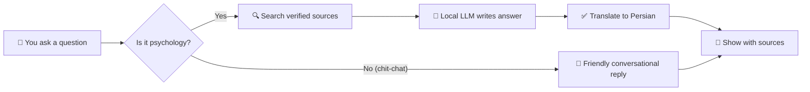

# 📚 Psyche-Agent Documentation

> **A complete guide to how this Persian psychology assistant works — written so anyone can follow it.**

Welcome! This is the documentation hub for **Psyche-Agent** (Ravanyar / روان‌یار), a Persian-language psychology information assistant. Use the table of contents below to jump to what you need.

---

## 🗂️ Table of Contents

| # | Page | What's inside | Audience |
|---|------|---------------|----------|
| 1 | [Overview](./01-overview.md) | What this project is, who it's for, what makes it different | Everyone |
| 2 | [Architecture](./02-architecture.md) | Big-picture diagram of every service and how they talk | Everyone |
| 3 | [Getting Started](./03-getting-started.md) | Step-by-step: clone → run → ask your first question | New users / developers |
| 4 | [Knowledge Pipeline](./04-knowledge-pipeline.md) | The journey of a PDF: upload → review → published | Content reviewers |
| 5 | [Agent & Chat](./05-agent-and-chat.md) | How questions become answers, chat sessions, languages, small-talk | Power users / developers |
| 6 | [API Reference](./06-api-reference.md) | Every endpoint, request/response examples, curl recipes | Integrators |
| 7 | [Code Walkthrough](./07-code-walkthrough.md) | File-by-file tour of every Python module and the UI | Developers |
| 8 | [Configuration](./08-configuration.md) | Every `.env` variable, defaults, what each one does | Operators |
| 9 | [Troubleshooting](./09-troubleshooting.md) | Things that break + how to fix them (incl. the docker file-mount gotcha) | Everyone |
| 10 | [Roadmap](./10-roadmap.md) | What's coming, known limits, internet-source TODO | Contributors |

---

## 🚀 30-Second Pitch

Psyche-Agent answers psychology questions in **Persian or English**, but only using documents that a **human reviewer has approved**. It will never make up clinical advice — if it doesn't know, it says so and tells you to consult a professional.

It runs **100% on your own machine**: no cloud, no API keys, no data leaving the box.

---

## 🧩 Tech Stack at a Glance

| Piece | Technology | Why |
|-------|------------|-----|
| 🧠 LLM | **Ollama** (local) | Free, private, runs anywhere |
| 🔍 Vector search | **Qdrant** | Fast similarity search over text |
| 🗄️ Documents | **MongoDB** | Stores staged + approved sources, chat history |
| ⚡ Cache | **Redis** | 1-hour cache for repeat questions |
| 🌐 Translation | **LibreTranslate** | Self-hosted FA ↔ EN |
| 🏷️ Review | **Label Studio** | Where humans approve/reject sources |
| 🎨 Frontend | Static HTML + nginx | Zero build step, just edit and refresh |
| ⚙️ Backend | **FastAPI** | Python 3.11, async, auto-generated `/docs` |

> 💡 **Tip:** every service runs in its own Docker container. See [Architecture](./02-architecture.md) for the network diagram.

---

## ⚠️ Critical Rules (Read These First)

> 🛑 **The Verified-Sources Rule**
> The agent **only** answers from documents marked `is_verified=true` in MongoDB. Raw PDFs in `staging_sources` are invisible to the LLM. There is no way to bypass this — even the developer can't make the agent quote an unreviewed source.

> 🛑 **The No-Diagnosis Rule**
> The system prompt forbids diagnoses, medication recommendations, and treatment plans. A guardrail validator scores every answer and rejects "pop-psychology" language ("guaranteed", "miracle cure", "manifest your…").

> 🛑 **The Docker Restart Rule**
> If you edit `ui/index.html` or any backend Python file, you **must** restart the container. See [Troubleshooting](./09-troubleshooting.md) for the exact commands. Skipping this serves stale code and looks like Claude broke the app.

---

## 🆘 Need Help Fast?

| If you want to... | Go to |
|---|---|
| Run the project for the first time | [Getting Started](./03-getting-started.md) |
| Upload a new PDF | [Knowledge Pipeline → Upload](./04-knowledge-pipeline.md#1-upload) |
| Understand why an answer was rejected | [Agent & Chat → Validator](./05-agent-and-chat.md#guardrails) |
| Fix "stats won't load" | [Troubleshooting → Stats not showing](./09-troubleshooting.md#stats-not-showing) |
| Change the LLM model | [Configuration → Ollama](./08-configuration.md#ollama) |
| Add internet search later | [Roadmap → Internet Source](./10-roadmap.md#internet-source-todo) |

---

## 📖 Glossary

- **RAG** — *Retrieval-Augmented Generation*. Find relevant passages first, then ask the LLM to write an answer using only those passages. Stops the LLM from inventing things.
- **Embedding** — A list of 384 numbers that represents the meaning of a sentence. Similar sentences have similar numbers.
- **Staging** — A waiting room. Uploaded PDFs sit here until a human approves them.
- **Verified source** — A passage the human reviewer approved. Only these reach the agent.
- **Trust score** — A number 0–1 the reviewer assigns to a source. Higher = more authoritative.
- **Small-talk path** — When you say "hi" the agent skips the source search and just chats back.
